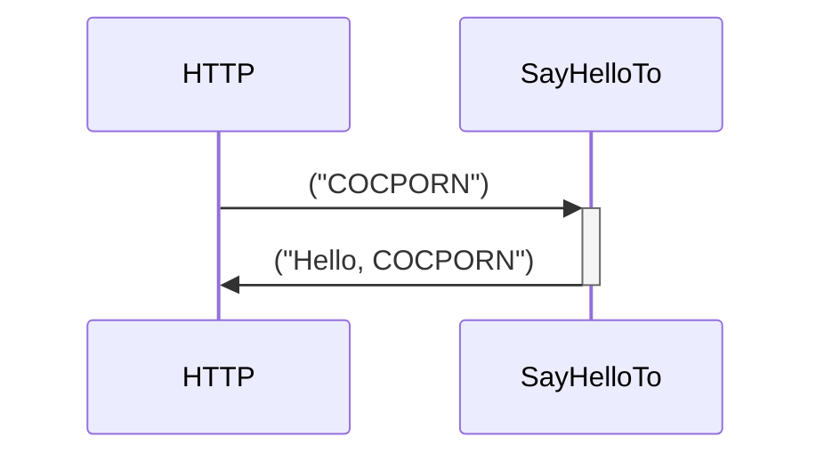

# OCore

 

Opinionated and experimental application stack built on Microsoft Orleans and friends.

## Hello World

New dotnet core console application. Add from nuget:

- `OCore.Setup`
- `Microsoft.Orleans.CodeGenerator.MSBuild`

Type:

```csharp
using OCore.Services;
await OCore.Setup.DeveloperExtensions.LetsGo();

namespace HelloWorld
{
    [Service("HelloWorld")]
    public interface IHelloWorldService : IService
    {
        Task<string> SayHelloTo(string name);
    }
    
    public class HelloWorldService : Service, IHelloWorldService
    {
        public Task<string> SayHelloTo(string name)
        {
            return Task.FromResult($"Hello, {name}! It is a beautiful world! And you are my favorite part of it!");
        }
    }
}
```

Press F5 and POST (using Postman/VS Code REST client):

```http
### Say hello to the world
POST http://localhost:9000/services/HelloWorld/SayHelloTo

"COCPORN"
```

You can also visit http://localhost:9000/swagger to see the OpenApi generated docs.

If you look at the CorrelationId-header in the response, you can paste it into your HTTP testing tool like this:

```http
### Get correlation log
POST http://localhost:9000/data/CorrelationIdRecorder/[INSERT ID HERE]/tomermaid
```

...and you will see it returns whatever sensible Mermaid diagram:



**nuget packages** are built automatically when version numbers are increased.

## Goals

- Programming at the speed of thought
- Self documenting system
- Simple transition from playground to production

## Motivation

Programming is fun. Plumbing is not.

If Microsoft Orleans is the best thing since sliced bread, why doesn't everyone use it always and forever and for everything?

OCore is an attempt to provide that delicious _F5_ experience. Start a new project, slap two nugets on it and press F5 to run. Orleans isn't hard to setup, but it can seem like it is  at first glance. Also, while the programming model is relatively immediately accessible to anyone with even a cursory grasp of OO modelling, things are different enough to potentially be daunting to newcomers. There are a lot of new concepts and quite a few pitfalls. Is hiding the intricacies a good idea? We'll see. It is not a given that it is.

Make no mistake, OCore is often just a thin wrapper on Orleans-concepts. Some common patterns are made into first class citizens (services, entities). Some repetitive tasks are implemented once and for all, and you can use it while developing and then replacing it before going into production, although the ultimate goal is that OCore code should be production ready at some point.

## Setup

### Development

Get started (silly developer wrapper on the hostbuilder setup). We all know what you want to do! You want to GO! So LET'S GO!

Install the NuGet package `OCore.Setup` and `Microsoft.Orleans.CodeGenerator.MSBuild`, then:

```csharp
    class Program
    {
        static async Task Main(string[] args) =>
            await OCore.Setup.DeveloperExtensions.LetsGo();
    }
```
F5 is waiting for you.

`LetsGo` automatically gives you this:

- Setup Orleans for localhost clustering with in-memory transient storage (the cluster will start up clean every time you start it)
- System setup functionality that allows it to be initialized with a root account
- Start listening for incoming requests at `http://localhost:9000`
- Automatically register any `Service` with exposed HTTP endpoints at `http://localhost:9000/services/`
- Automatically register any `DataEntity` with exposed HTTP endpoints at `http://localhost:9000/data/`
- Start serving OpenApi documentation for services and data entities at `http://localhost:9000/api-docs/`
- Setup authorization system with user tokens and api-keys (optional use)

## Service 

**When to use**: Use services when you have a problem that is _task based_, as in "I have a task I need to get done". This is opposed to _data based_, as in "I have some data I need to get grokked". Services provide an RPC (remote procedure call)-like interface to the cluster. This is often practical if you need to orchestrate multiple data entities, or do compute based work.

Services are activated in the cluster multiple times, and have no identity.

An OCore Service is implemented as a stateless, reentrant integer keyed grain. It can _optionally_ be automatically published to an HTTP endpoint. An exposed Service will always be hit with identity `0`, so there will be no explosion of grains on the server. An exposed Service is an opinionated alternative to an ASPNET Core `Controller`, with these benefits:

- No plumbing to get to the cluster
- No chance of accidentally putting business logic in the controllers
- Easy to maintain
- Easy to learn
- Plays (relatively) nice with some relevant parts of ASPNET Core
- Plays nice with the authorization system

Define an interface to the service. Decide mentally if you want this to be an external or internally available interface. 

```csharp
[Service("MyService")]
public interface IMyService : IService 
{
    Task<string> Hello(string name);
}
```

Then implement it:

```csharp
public class MyService : Service 
{
    public Task<string> Hello(string name) 
    {
        return Task.FromResult($"Hello, {name}");
    }
}
```

Using Postman or the Visual Studio Code REST client (I will be using this in the coming examples, and you can find a bunch of `.http`-files in this repository to help testing):

```
### Say Hello
POST http://localhost:9000/service/MyService/Hello

["COCPORN"]
```

The service will then respond with a 200-message with a string HTTP body of `"Hello, COCPORN"`.

### Parameter passing

Parameters can be passed in these ways:

- A list of parameters
- A single request object
- Empty body if there are no parameters, or if all parameters are default parameters

Passing a single request object is short hand for passing a list with a single entry request object.

Parameter lists support complex types and default parameters.

### Internal services

If you do not want to publish any services, do not call `MapServices` (this is called automatically from `UseDefaultOCore()`). If you want to stop specific services from being published, you can decorate them with the `[Internal]`-attribute. If you want specific methods on a service to not be published, you can similarly decorate them with the `[Internal]`-interface.

```csharp
[Service("PrivateService")]
[Internal]
public interface IPrivateService : IService 
{
    Task<Guid> TellMeASecret(int left, int right);
}

[Service("ShyService")]
public interface IShyService: IService 
{
    Task<Joke> TellMeAJoke();

    [Internal]
    Task<string> GiveMeAWinningLotteryNumber();
}
```

### HTTP calls

You can decorate methods with attributes that implement `IAuthorizationFilter` (the ASPNET Core interface):

```csharp
public class AuthorizedService : IAuthorizedService, Service 
{    
    [Authorize]
    Task<Guid> TellMeASecret(int left, int right) 
    {
        // ...
    }
}
```

There is support for running asynchronous action filters, although these are not currently compatible with the ASPNET Core interface. Look in `OCore.Http.Abstractions` for `IAsyncActionFilter.cs`.

### Service client

There is currently a loosely typed Service client that works in Blazor and other dotnet projects (the interface for this _will change_):

```csharp
var (response, status) = await Client.Invoke<IMyService, string>("Hello", "COCPORN");
```

I am toying with the idea of making a strongly typed client using Roslyn code generation.

## Data Entities

**When to use**: Use data entities when you have a problem that is data based_, as in "I have discrete data that I need to grok". This is opposed to _task based_, as in "I have some tasks I need to get done". Services optionally provide a CRUD(Create/Read/Update/Delete) interface to the cluster.

OCore Data Entities are a quick way to model data so that it is accessible inside and optionally outside the cluster.

Data Entities are _single activation_ based on their identity.

Data Entities can serve their innards over HTTP. They can also be extended with commands. Also, the authorization framework can decide which Data Entities an API key has access to, more about this later.

Data Entities are implemented as `Grain` with `IGrainWithStringKey`.

### Implicit access

By default, a `DataEntity` only provides `Read`-access. Depending on how you set `DataAccessMethod`, the interface methods will be mapped this way:

- `Create` (mapped to `POST`)
- `Read` (mapped to `GET`)
- `Update` (mapped to `PUT`)
- `Upsert` (not mapped)
- `Delete` (mapped to `DELETE`)

If an entity is not created, all calls except `POST` will fail over HTTP.

By default, only `GET` and commands are registered. You can decide what methods you want mapped in the `DataEntity`-attribute.

### Example

```csharp
public class ShortenedUrl 
{
    public string RedirectTo { get; set; }

    public int TimesVisited { get; set; }
}

[DataEntity("ShortenedUrl", dataEntityMethods: DataEntityMethods.All)]
public interface IShortenedUrl : IDataEntity<ShortenedUrl>
{
    Task<string> Visit();
}
```

...with the implementation:

```csharp
public class ShortenedUrlEntity : DataEntity<ShortenedUrl>, IShortenedUrl
{
    public async Task<string> Visit() 
    {
        State.TimesVisited++;
        await WriteStateAsync();
        return State.RedirectTo;
    }
}
```

If `MapDataEntities` is called (as is default by `UseDefaultOCore`), you can now do:

```http
### Create shortened URL
POST http://localhost:9000/data/ShortenedUrl/SomeId

{
    "RedirectTo": "http://www.cocporn.com"
}
```

This will create the entity.

```http
### Get shortened URL data object
GET http://localhost:9000/data/ShortenedUrl/SomeId
```

...will return:

```json
{
    "RedirectTo": "http://www.cocporn.com",
    "TimesVisited": 0
}
```

Call `Visit`-method:

```http
### "Visit" the Data Entity
POST http://localhost:9000/data/ShortenedUrl/SomeId/Visit
```

This will call the `Visit`-method updating the counter, and return the `RedirectTo`-string.

## Multi fetch

Using `GET`, you can do multifetch using HTTP:

```http
### Multi fetch
GET http://localhost:9000/data/SomeDataEntity/Id1,Id2,Id5
```

This will return:

```json
[
    {
        "data": "id1-data"
    },
    null,
    {
        "data": "id5-data"
    }
]
```

This indicates that the system was able to fetch data for Id1 and Id5, but not for Id2.

This works regardless of key strategy, meaning that if a data entity is account prefixed, fetching `id1`, `id2` will translate to `accountId:id1` and `accountId:id2`, maintaining the integrity of the sandbox.

Support for more methods of fan-out is coming.

### Key strategies

`DataEntity` implements different key strategies. Deciding on the key strategy will optionally make Data Entities interplay with the authorization system.
 The Data Entity key strategies are:

- Account - The Data Entity will be tied to the account of the request. This means that a GET path will be something like `http://localhost:9000/data/me`. It will not accept an ID
- AccountPrefix - The Data Entity will be prefixed with the account and accept a separate ID, ex.: `http://localhost:9000/data/contact/Jonas` will be keyed as `03A9765C-2A7E-4780-A368-CCA645C4B278:Jonas`. Failing to provide an ID will result in a 404
- AccountCombined - The Data Entity will use `Guid.Combine` to create a key. Example: `03A9765C-2A7E-4780-A368-CCA645C4B278:70A3DA00-8D21-4BA8-B833-971E616079C8`. This will fail if the identity is not a Guid.
- AccountCombinedPrefix - The Data Entity will use `Guid.Combine` to create a key. Example: `03A9765C-2A7E-4780-A368-CCA645C4B278:70A3DA00-8D21-4BA8-B833-971E616079C8:chat`. This will fail if the identity is not a Guid.
- Global - All entities of this Data Entity will have the key `Global`, meaning all requests will hit the same activation. 
- Identity - The Data Entity will take the identity from the route, example: `http://localhost:9000/data/blogpost/first` will create the key `first`. Everyone who know the identity of the entity can access it
- Tenant - The Data Entity will be keyed on Tenant. This will be fetched from the request payload. `http://localhost:9000/data/tenantconfiguration` will be keyed on `tenant1`
- TenantPrefix - The Data Entity will be keyed on Tenant ID with identity picked from route. `http://localhost:9000/data/tenantuser/Peter` will be keyed on `tenant1:Peter`


## `Entity<T>`

`Entity<T>` is what Data Entities and others are based on. They provide a helpful layer in addition to `Grain<T>` by:

- The Grain key is deconstructed into `KeyString`, `KeyGuid`, `KeyLong` and `KeyExtension`
- `Entity<T>` adds tenant information so that it is easy to get to, using `TenantId`
- API is very similar to that of `Grain<T>`, so in most cases it will be a drop-in replace. **NOTE**: The shape of the stored data is _different_, so you cannot change this after you have started storing data. If in doubt, just use `Entity<T>` for everything

## Events 

OCore has a system for event handling based on Orleans Streams that provides:

- Event aggregation
    - Workload management
        - Scale uniformly or to cluster size
- Controlled event handling
    - Poison event handling (dependent on the stream backend retrying failed events, like Azure Storage Queues)

Create an event:

```csharp
[Event("EventName")]
public class MyEvent 
{
    public string Greeting { get; set; }
}
```

Raise the event using the event aggregator:

```csharp
GrainFactory
    .GetEventAggregator()
    .Raise(new MyEvent 
        { 
            Greeting = "Hello world!" 
        });
```

Handle events:

```csharp
[EventHandler("EventName")]
public class HandleMyEvents : EventHandler<MyEvent> {
    protected override Task HandleEvent(MyEvent @event)
    {
        Console.WriteLine(@event.Greeting);
        return base.HandleEvent(@event);
    }
}
```

The eventing system is many-to-many, as in: Events can be raised anywhere in the code where you can get a hold of the event aggregator and each event can be handled by multiple handlers.
